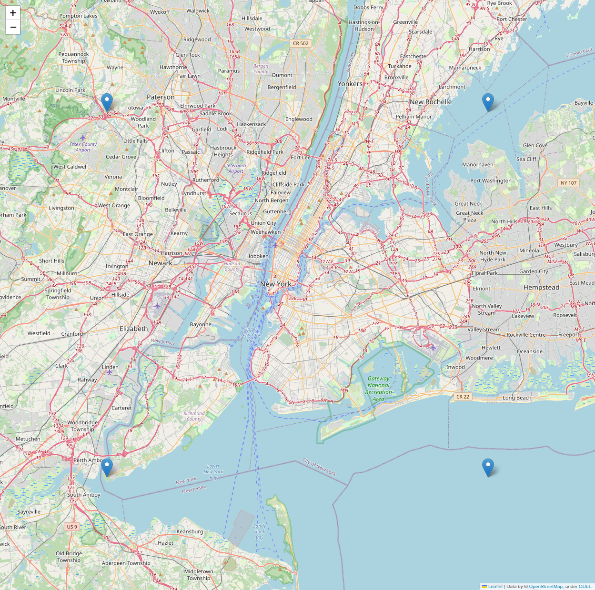

# IA_626
## Assignment No :04
### Analyzing the datset of Taxi Rides in NYS

##### Q1. What datetime range does your data cover?  How many rows are there total?
###### The data covers the datetime range from March 1, 2013 at 00:00:00 to March 31, 2013 at 23:59:58 for pickup dates, and from March 1, 2013 at 00:00:39 to April 1, 2013 at 01:16:32 for dropoff dates and the total number of rows are **15749228**.
|   Type   |           Datetime Range           |
|----------|------------------------------------|
|  Pickup  | 2013-03-01 00:00:00 - 2013-03-31 23:59:58 |
|  Dropoff | 2013-03-01 00:00:39 - 2013-04-01 01:16:32 |

##### Q2. What are the field names?  Give descriptions for each field.
###### The dataset contains information about taxi trips, including unique identifiers for the taxi and driver, trip details, and pickup/dropoff locations. The fields include medallion, hack_license, vendor_id, rate_code, store_and_fwd_flag, pickup_datetime, dropoff_datetime, passenger_count, trip_time_in_secs, trip_distance, pickup_longitude, pickup_latitude, dropoff_longitude, and dropoff_latitude.
| Field Name         | Description                                                                                     |
|--------------------|-------------------------------------------------------------------------------------------------|
| medallion          | A unique identifier for the taxi cab.                                                           |
| hack_license       | A unique identifier for the taxi driver.                                                        |
| vendor_id          | A code indicating the taxi vendor.                                                              |
| rate_code          | The rate code for the trip.                                                                     |
| store_and_fwd_flag | A flag indicating whether the trip data was stored in the vehicle before sending to the server. |
| pickup_datetime    | The date and time when the passenger was picked up.                                             |
| dropoff_datetime   | The date and time when the passenger was dropped off.                                           |
| passenger_count    | The number of passengers on the trip.                                                           |
| trip_time_in_secs  | The length of the trip in seconds.                                                              |
| trip_distance      | The distance of the trip in miles.                                                              |
| pickup_longitude   | The longitude of the pickup location.                                                           |
| pickup_latitude    | The latitude of the pickup location.                                                            |
| dropoff_longitude  | The longitude of the dropoff location.                                                          |
| dropoff_latitude   | The latitude of the dropoff location.                                                           |

##### Q3. Give some sample data for each field.
###### The table provides a summary of unique sample data for each field in the dataset. Each row corresponds to a specific field, with the field name in the first column and a list of five unique sample values in the second column.

###### In the "passenger_count" field, there is an outlier with a value of 255 passengers. This value is significantly higher than the other sample values (4, 3, 7, and 6) and could potentially indicate an error in the data or an unusual event.
| Field Name          | Unique Values                                                                                              |
|---------------------|------------------------------------------------------------------------------------------------------------|
| medallion           | 0E0569377FEAE2A65216459409656B05, 8097F829A0EB7C9942A6F88CE72C9FC8, 9D00F31E2C114E3699A745BC9E7BFCE9, ... |
| hack_license        | 11584E83BA244D9F682B2529327C39B2, D79250287478EC80548375003AC3A295, 76BFB84E8CE9800646761D5517EB0E4E, ... |
| vendor_id           | CMT, VTS                                                                                                   |
| rate_code           | 4, 3, 7, 8, 6                                                                                              |
| store_and_fwd_flag  | Y, N                                                                                                       |
| pickup_datetime     | 2013-03-10 23:19:51, 2013-03-23 10:29:49, 2013-03-15 08:56:05, 2013-03-31 00:00:47, 2013-03-02 00:53:37  |
| dropoff_datetime    | 2013-03-10 23:19:51, 2013-03-23 10:29:49, 2013-03-15 08:56:05, 2013-03-31 00:00:47, 2013-03-02 00:53:37  |
| passenger_count     | 4, 3, 7, 6, 255                                                                                            |
| trip_time_in_secs   | 1502, 8442, 655, 3637, 739                                                                                 |
| trip_distance       | 13.72, 25.91, 12.92, 32.23, 14.90                                                                          |
| pickup_longitude    | -73.950684, -73.782349, -73.93354, -73.925117, -73.728188                                                  |
| pickup_latitude     | 40.726723, 40.717781, 40.686554, 40.823627, 40.665997                                                      |
| dropoff_longitude   | -73.950684, -73.93354, -74.170288, -73.782349                                                              |
| dropoff_latitude    | 40.686554, 40.665997, 40.622482, 40.959534                                                                 |

##### Q4. What MySQL data types / len would you need to store each of the fields?
###### The dataset contains attributes such as medallion, hack_license, vendor_id, rate_code, and other details related to the trips. The provided answer lists a table with recommended MySQL data types and lengths for each field, ensuring the data is stored effectively and accurately within a database. Choosing the correct data types and lengths is an essential aspect of designing a database schema, as it contributes to optimal storage usage and efficient query execution.

| Field              | Data Type      |
|--------------------|------------------|
| medallion          | varchar(40)      |
| hack_license       | varchar(40)      |
| vendor_id          | varchar(5)      |
| rate_code          | int(10)          |
| store_and_fwd_flag | bool             |
| pickup_datetime    | datetime         |
| dropoff_datetime   | datetime         |
| passenger_count    | int(10)          |
| trip_time_in_secs  | int(50)          |
| trip_distance      | decimal(10,4)     |
| pickup_longitude   | decimal(9,6)     |
| pickup_latitude    | decimal(9,6)     |
| dropoff_longitude  | decimal(9,6)     |
| dropoff_latitude   | decimal(9,6)     |

##### Q5.What is the geographic range of your data (min/max - X/Y)? Plot this (approximately on a map)
###### The first step in our analysis was to filter out any records with missing or invalid data. We also restricted our analysis to trips with pickup and dropoff locations within a specific geographic range of New York City.
###### The geographic range of the data can be visualized by plotting the bounding box or rectangle that encompasses the entire geographic range. To achieve this, you would need four points, which are the combinations of the minimum and maximum latitude and longitude values:

###### Bottom-left corner: (min_lat, min_lon)
###### Bottom-right corner: (min_lat, max_lon)
###### Top-left corner: (max_lat, min_lon)
###### Top-right corner: (max_lat, max_lon)
###### By plotting these four points on a map, we can visualize the rectangle that covers the entire geographic range of your data. We also computed the minimum and maximum latitude and longitude coordinates within our filtered dataset and displayed this information in a table.
| Coordinate |   Min    |    Max     |
|------------|----------|------------|
|  Latitude  | 40.50053 | 40.899963  |
| Longitude  |  -74.25  | -73.700111 |

##### Q6. What is the average computed trip distance? (You should use Haversine Distance) Draw a histogram of the trip distances binned anyway you see fit.

###### The average computed trip distance, calculated using the Haversine Distance formula, is approximately 18.71 km. This value represents the average distance between pickup and drop-off locations for all trips in the dataset, taking into account the curvature of the Earth. The Haversine Distance formula provides a more accurate estimation of the distance between two points on the Earth's surface compared to using a simple Euclidean distance calculation, which would not account for the Earth's spherical shape.
