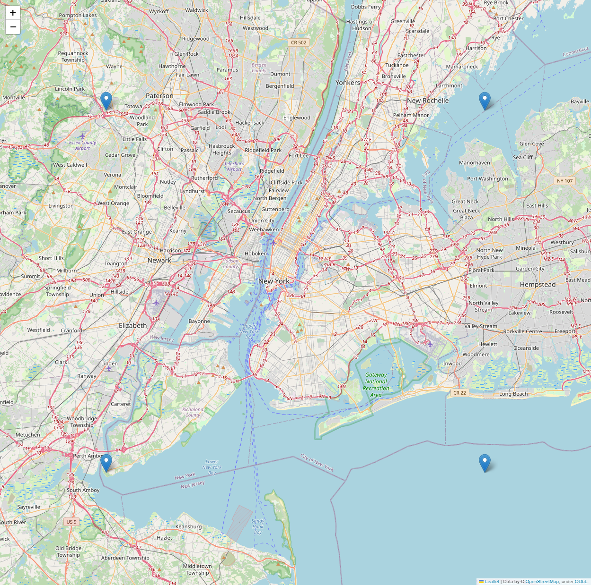
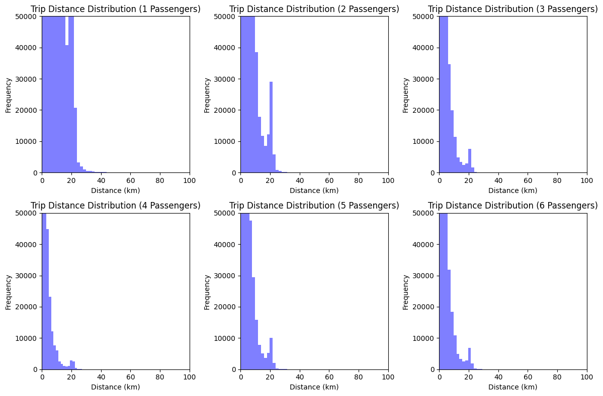
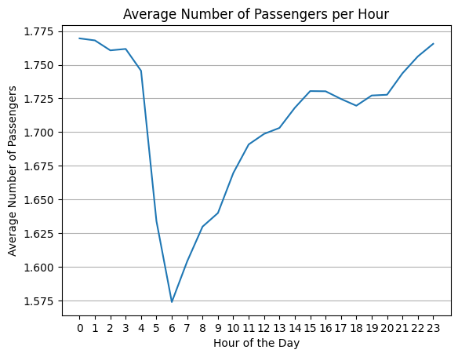
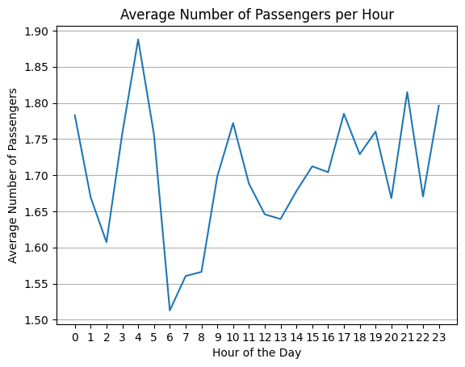
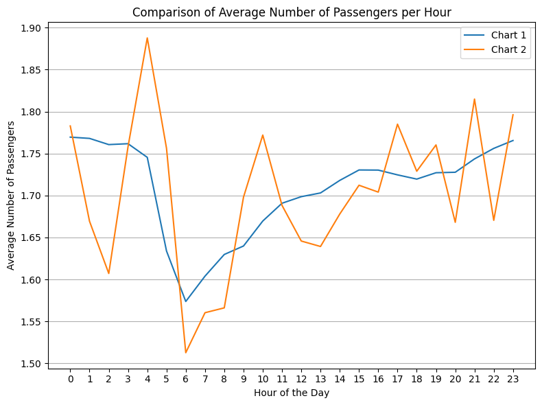

# Name - Anuj Patil
# IA_626 - Assignment No :04
## Analyzing the datset of Taxi Rides in NYS - (3rd Dataset)

### Q1. What datetime range does your data cover?  How many rows are there total?
###### The data covers the datetime range from March 1, 2013 at 00:00:00 to March 31, 2013 at 23:59:58 for pickup dates, and from March 1, 2013 at 00:00:39 to April 1, 2013 at 01:16:32 for dropoff dates and the total number of rows are **15749228**.
|   Type   |           Datetime Range           |
|----------|------------------------------------|
|  Pickup  | 2013-03-01 00:00:00 - 2013-03-31 23:59:58 |
|  Dropoff | 2013-03-01 00:00:39 - 2013-04-01 01:16:32 |

### Q2. What are the field names?  Give descriptions for each field.
###### The dataset contains information about taxi trips, including unique identifiers for the taxi and driver, trip details, and pickup/dropoff locations. The fields include medallion, hack_license, vendor_id, rate_code, store_and_fwd_flag, pickup_datetime, dropoff_datetime, passenger_count, trip_time_in_secs, trip_distance, pickup_longitude, pickup_latitude, dropoff_longitude, and dropoff_latitude.
| Field Name         | Description                                                                                     |
|--------------------|-------------------------------------------------------------------------------------------------|
| medallion          | A unique identifier for the taxi cab.                                                           |
| hack_license       | A unique identifier for the taxi driver.                                                        |
| vendor_id          | A code indicating the taxi vendor.                                                              |
| rate_code          | The rate code for the trip.                                                                     |
| store_and_fwd_flag | A flag indicating whether the trip data was stored in the vehicle before sending to the server. |
| pickup_datetime    | The date and time when the passenger was picked up.                                             |
| dropoff_datetime   | The date and time when the passenger was dropped off.                                           |
| passenger_count    | The number of passengers on the trip.                                                           |
| trip_time_in_secs  | The length of the trip in seconds.                                                              |
| trip_distance      | The distance of the trip in miles.                                                              |
| pickup_longitude   | The longitude of the pickup location.                                                           |
| pickup_latitude    | The latitude of the pickup location.                                                            |
| dropoff_longitude  | The longitude of the dropoff location.                                                          |
| dropoff_latitude   | The latitude of the dropoff location.                                                           |

### Q3. Give some sample data for each field.
###### The table provides a summary of unique sample data for each field in the dataset. Each row corresponds to a specific field, with the field name in the first column and a list of five unique sample values in the second column.

###### In the "passenger_count" field, there is an outlier with a value of 255 passengers. This value is significantly higher than the other sample values (4, 3, 7, and 6) and could potentially indicate an error in the data or an unusual event.
| Field Name          | Sample Data                                                                                              |
|---------------------|------------------------------------------------------------------------------------------------------------|
| medallion           | 0E0569377FEAE2A65216459409656B05, 8097F829A0EB7C9942A6F88CE72C9FC8, 9D00F31E2C114E3699A745BC9E7BFCE9, ... |
| hack_license        | 11584E83BA244D9F682B2529327C39B2, D79250287478EC80548375003AC3A295, 76BFB84E8CE9800646761D5517EB0E4E, ... |
| vendor_id           | CMT, VTS                                                                                                   |
| rate_code           | 4, 3, 7, 8, 6                                                                                              |
| store_and_fwd_flag  | Y, N                                                                                                       |
| pickup_datetime     | 2013-03-10 23:19:51, 2013-03-23 10:29:49, 2013-03-15 08:56:05, 2013-03-31 00:00:47, 2013-03-02 00:53:37  |
| dropoff_datetime    | 2013-03-10 23:19:51, 2013-03-23 10:29:49, 2013-03-15 08:56:05, 2013-03-31 00:00:47, 2013-03-02 00:53:37  |
| passenger_count     | 4, 3, 7, 6, 255                                                                                            |
| trip_time_in_secs   | 1502, 8442, 655, 3637, 739                                                                                 |
| trip_distance       | 13.72, 25.91, 12.92, 32.23, 14.90                                                                          |
| pickup_longitude    | -73.950684, -73.782349, -73.93354, -73.925117, -73.728188                                                  |
| pickup_latitude     | 40.726723, 40.717781, 40.686554, 40.823627, 40.665997                                                      |
| dropoff_longitude   | -73.950684, -73.93354, -74.170288, -73.782349                                                              |
| dropoff_latitude    | 40.686554, 40.665997, 40.622482, 40.959534                                                                 |

### Q4. What MySQL data types / len would you need to store each of the fields?
###### The dataset contains attributes such as medallion, hack_license, vendor_id, rate_code, and other details related to the trips. The provided answer lists a table with recommended MySQL data types and lengths for each field, ensuring the data is stored effectively and accurately within a database. Choosing the correct data types and lengths is an essential aspect of designing a database schema, as it contributes to optimal storage usage and efficient query execution.

| Field              | Data Type      |
|--------------------|------------------|
| medallion          | varchar(40)      |
| hack_license       | varchar(40)      |
| vendor_id          | varchar(5)      |
| rate_code          | int(10)          |
| store_and_fwd_flag | bool             |
| pickup_datetime    | datetime         |
| dropoff_datetime   | datetime         |
| passenger_count    | int(10)          |
| trip_time_in_secs  | int(50)          |
| trip_distance      | decimal(10,4)     |
| pickup_longitude   | decimal(9,6)     |
| pickup_latitude    | decimal(9,6)     |
| dropoff_longitude  | decimal(9,6)     |
| dropoff_latitude   | decimal(9,6)     |

### Q5.What is the geographic range of your data (min/max - X/Y)? Plot this (approximately on a map)
###### The first step in our analysis was to filter out any records with missing or invalid data. We also restricted our analysis to trips with pickup and dropoff locations within a specific geographic range of New York City.
###### The geographic range of the data can be visualized by plotting the bounding box or rectangle that encompasses the entire geographic range. To achieve this, you would need four points, which are the combinations of the minimum and maximum latitude and longitude values:

###### Bottom-left corner: (min_lat, min_lon)
###### Bottom-right corner: (min_lat, max_lon)
###### Top-left corner: (max_lat, min_lon)
###### Top-right corner: (max_lat, max_lon)
###### By plotting these four points on a map, we can visualize the rectangle that covers the entire geographic range of your data. We also computed the minimum and maximum latitude and longitude coordinates within our filtered dataset.
| Coordinate |   Min    |    Max     |
|------------|----------|------------|
|  Latitude  | 40.50053 | 40.899963  |
| Longitude  |  -74.25  | -73.700111 |

### Q6. What is the average computed trip distance? (You should use Haversine Distance) Draw a histogram of the trip distances binned anyway you see fit.

###### The average computed trip distance, calculated using the Haversine Distance formula, is approximately 3.28 km. This value represents the average distance between pickup and drop-off locations for all trips in the dataset, taking into account the curvature of the Earth. The Haversine Distance formula provides a more accurate estimation of the distance between two points on the Earth's surface compared to using a simple Euclidean distance calculation, which would not account for the Earth's spherical shape.
###### The code then computes the average trip distance, which is the total distance of all trips divided by the total number of trips. It also plots a histogram of the trip distances, binned by passenger count. The histogram shows the frequency of trip distances for each passenger count range.

### Q7. What are the distinct values for each field? (If applicable)

###### Code reads a CSV file and processes it to find the distinct values for each field (column) in the dataset. It stores the distinct values for each field in a dictionary and then prints them out in a tabular format using the PrettyTable library. The output table includes the field names and a comma-separated list of the distinct values found for each field. To keep the output manageable, only the first 10 distinct values are shown for each field, followed by an ellipsis (...) to indicate that there are more values if there are more than 10 distinct values.

| Field Name          |  Distinct values                                                                                              |
|---------------------|------------------------------------------------------------------------------------------------------------|
| medallion           | 00005007A9F30E289E760362F69E4EAD, 000318C2E3E6381580E5C99910A60668, 000351EDC735C079246435340A54C7C1, 0009986BDBAB2F9A125FEF49D0BFCCDD, 00115F46520039845A5F719C979BEA45, 00153E36140C5B2A84EA308F355A7925, 001C8EC421C9BE57D08576617465401A, 001D3B86C2ACDEE4D1B98AFE52969F3D, 001DFAC01BC0A32F48C3769DD1414778, 00244196AAA321571762E0CCC55EEAD9...  |
| hack_license        | 0002555BBE359440D6CEB34B699D3932, 0008B3E338CE8C3377E071A4D80D3694, 000A4EBF1CEB9C6BD9978D4362493C6E, 000B8D660A329BBDBF888500E4BD8B98, 000C15EFBDF58CAED528C09E597484EC, 00117D7CCD47D125E77163A7AC2C66EB, 0011B1575B9F5398BBC0F27EA560D631, 0012703023AC1788D34F6694908900FC, 001755823155165E769E3CDFC7EAB87F, 00184958F5D5FD0A9EC0B115C5B55796...|
| vendor_id           | CMT, VTS                                                                                                   |
| rate_code           | 0, 1, 17, 2, 210, 3, 4, 5, 6, 7...                                                                                              |
| store_and_fwd_flag  | Y, N                                                                                                       |
| pickup_datetime     |  2013-03-01 00:00:00, 2013-03-01 00:00:01, 2013-03-01 00:00:02, 2013-03-01 00:00:04, 2013-03-01 00:00:05, 2013-03-01 00:00:06, 2013-03-01 00:00:07, 2013-03-01 00:00:08, 2013-03-01 00:00:09, 2013-03-01 00:00:10...  |
| dropoff_datetime    | 2013-03-01 00:00:39, 2013-03-01 00:01:13, 2013-03-01 00:01:18, 2013-03-01 00:01:37, 2013-03-01 00:01:43, 2013-03-01 00:01:59, 2013-03-01 00:02:00, 2013-03-01 00:02:03, 2013-03-01 00:02:14, 2013-03-01 00:02:20...  |
| passenger_count     | 0, 1, 2, 255, 3, 4, 5, 6, 7, 9                                                                                            |
| trip_time_in_secs   | 0, 1, 10, 100, 1000, 1001, 1002, 10020, 1003, 1004...                                                                                 |
| trip_distance       | 00, .01, .02, .03, .04, .05, .06, .07, .08, .09...                                                                          |
| pickup_longitude    | -0.000153, -0.000233, -0.000635, -0.001005, -0.001022, -0.0015, -0.001547, -0.001627, -0.001667, -0.002023...                                                   |
| pickup_latitude     | -0.138667, -0.56166703, -0.56333297, -10.273537, -1353.5311, -1353.548, -1678.3635, -2334.4236, -2475.6619, -2485.6887...                                                      |
| dropoff_longitude   |-0.00107, -0.001293, -0.001333, -0.001417, -0.001667, -0.002083, -0.002632, -0.002657, -0.003093...                                                               |
| dropoff_latitude    |-0.138667, -0.56166703, -0.56333297, -13.058743, -1678.3635, -2384.2996, -2475.6643, -2485.7087, -2497.6982...                                                                 |

### Q8. For other numeric types besides lat and lon, what are the min and max values?
###### Code analyzes a CSV file containing data on taxi trips and finds the minimum and maximum values for each numeric field in the file, excluding latitude and longitude fields. The find_min_max_values() function reads in the CSV file, skips over latitude and longitude fields, and iterates over each row to find the minimum and maximum values for each numeric field. The print_min_max_table() function formats the results in a table using the PrettyTable library and prints it to the console.

| Field               | Min Value   | Max Value   |
|---------------------|-------------|-------------|
| rate_code           | 0.0         | 210.0       |
| passenger_count     | 0.0         | 255.0       |
| trip_time_in_secs   | 0.0         | 10800.0     |
| trip_distance       | 0.0         | 100.0       |

### Q9. Create a chart which shows the average number of passengers each hour of the day. (X axis should have 24 hours)
###### The given code reads a CSV file containing taxi trip data and calculates the average number of passengers for each hour of the day. It plots a line graph with the x-axis representing the 24 hours of the day and the y-axis representing the average number of passengers. The function calculate_average_passengers_per_hour takes the CSV file name as input and returns a list of average passengers for each hour. The function plot_average_passengers_per_hour takes the list of average passengers as input and plots the line graph.

###### This chart is useful to understand the variation in the average number of passengers per hour. It can help identify the hours with the highest and lowest average number of passengers, which can be useful for scheduling drivers or determining pricing strategies.

### Q10. Create a new CSV file which has only one out of every thousand rows. 
###### The code reads a CSV file named "trip_data_3.csv", creates a new CSV file named "new.csv", and writes to it every 1000th row of the original file. It uses the Python CSV library to read and write to the files.

###### Total rows in the original file: 15749228
###### Rows in the new file: 15749

### Q11.  Repeat step 9 with the reduced dataset and compare the two charts.
###### The code generates a line chart, by computing the average number of passengers per hour for a reduced dataset. The reduced dataset is obtained by selecting only one out of every thousand rows from the original 'trip_data_3.csv' file. The code calls the 'calculate_average_passengers_per_hour' function, which computes the average number of passengers per hour for each hour of the day from the reduced dataset. The 'plot_average_passengers_per_hour' function is then called to plot the resulting data in a line chart, using Matplotlib. The resulting chart shows the average number of passengers per hour against the hour of the day, providing a less granular view of the data than the original dataset used to generate chart1. However, it still allows us to see trends in passenger counts over time.

###### This chart, shows a comparison of the average number of passengers per hour for the original and reduced datasets, allowing us to see any differences or similarities in passenger counts over time.

